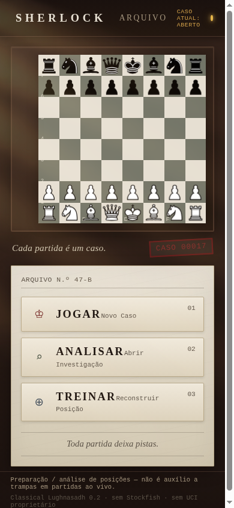
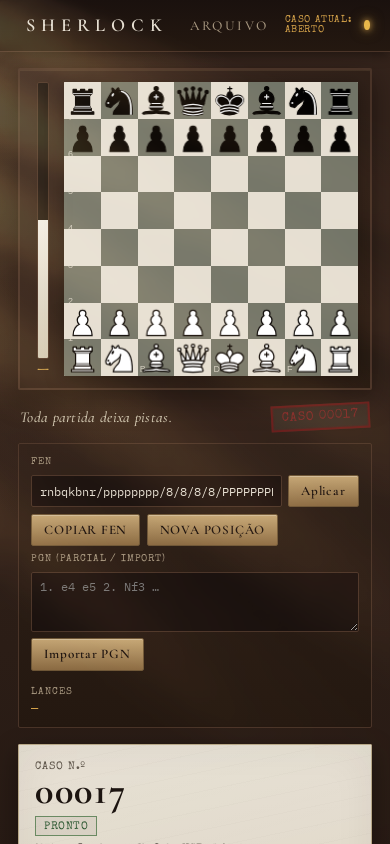

# S H E R L O C K

A visual chess investigation and analysis environment integrating a React web interface, WebSocket controller, UCI adapter, and native Lughnasadh engine execution.

**Stack:** React, TypeScript, Vite, Node.js, Express, WebSocket, chess.js and Chessground; Android WebView and a native process bridge.

**Status:** version 0.1.3, with an [Android APK release](https://github.com/lughlammas/sherlock/releases/tag/v0.1.3). The supplied Android integration uses Lughnasadh 0.2; the separately maintained 0.4.0 engine has not been integrated or validated here. Parser/session tests and engine smoke scripts are included; no strength or performance benchmark is claimed.

By Guilherme Cavalcanti / LughLammas, maintained within **ARBOCK LABS**, an independent software and applied-AI lab currently being structured.

## Screenshots

| Hub | Analyze |
|---|---|
|  |  |

**APK:** [v0.1.3](https://github.com/lughlammas/sherlock/releases/tag/v0.1.3)

---

## Architecture

```
GUI (React)
   ↓ WebSocket
Sherlock Controller
   ↓ classical UCI only
Lughnasadh Adapter
   ↓ child process
Lughnasadh v0.2 binary
```

- The GUI **never** speaks raw UCI.
- The adapter owns: start, `uci`/`isready`, commands, parse `info`/`bestmove`, cancel, time limits, **session tokens** (stale replies discarded).
- Board FEN **survives** engine timeout / crash / restart.

```
┌────────────┐   WS    ┌──────────────────┐   UCI   ┌─────────────────┐
│  Browser   │◄───────►│ SherlockController│◄───────►│ LughnasadhAdapter│──► lughnasadh
│  React UI  │         │  + Express/WS     │         │  sessionId gate  │
└────────────┘         └──────────────────┘         └─────────────────┘
```

---

## Engine binary

Desktop analysis requires a locally built native Lughnasadh executable. Set `LUGHNASADH_PATH` to its absolute path before starting the server. The adapter also checks `engines/lughnasadh`; the repository's historical symlink/fallback is environment-specific and should not be assumed to work on a fresh clone.

The adapter supports `uci`, `isready`, `ucinewgame`, `position`, `go depth`, `go movetime`, `stop`, and `quit`.

## Run

```bash
cd sherlock   # your cloned repository
npm install
npm run build
npm start
# → http://127.0.0.1:8787
```

Dev (API on 8787 + Vite on 5173):

```bash
npm run dev
```

Smoke (real binary):

```bash
npm run smoke
```

Parser and local-adapter session tests (no native engine required):

```bash
npm test
```

---

## Executar (PT)

```bash
npm install && npm run build && npm start
```

Abra `http://127.0.0.1:8787`. Conecta ao Lughnasadh 0.2 no boot (`onEngineReady`). Use **ANALYZE** / **STOP**, carregue FEN, veja depth/nodes/nps/eval/PV e a conclusão **BEST MOVE**.

---

## MVP

1. Tabuleiro responsivo (chess.js + chessground)
2. Load FEN + NEW POSITION (startpos) + COPY FEN
3. Connect on boot → `onEngineReady`
4. ANALYZE (`go depth 12` ou `go movetime 2000`)
5. Live `onEngineInfo` → depth, nodes, nps, time, eval bar, PV
6. `onBestMove` → conclusion + highlight
7. STOP
8. Diagnostic log (UCI trail)
9. States: READY / INVESTIGATING… / BEST MOVE / ENGINE ERROR (+ Retry/Restart)
10. SessionId drops stale replies; position preserved across restart

---


---

## CASO CRUZADO — Lughnasadh × Lughnasadh (JOGAR)

Engine match mode: **two** independent Lughnasadh 0.2 processes (White + Black), classical UCI only.

- Threads option max is **1** → dual process instead of multi-thread.
- Default full power: **Hash 512MB per engine** (UCI max 4096), `go movetime 4000` (or depth 18+).
- Continuous until mate/draw or STOP, with a live PGN stream. Resource settings are configuration values, not evidence of playing strength.
- UI warns about battery/RAM; intentional for Galaxy S21 stress.

Desktop smoke:

```bash
npm run smoke:match
```

Android: dual `ProcessBuilder` slots (`main` / `white` / `black`) via `SherlockUci`.


## Scope and limitations

The integrated engine is Lughnasadh 0.2 with classical UCI. Native-engine analysis requires an available executable; mocks in the test suite exercise parser/session behavior. Engine match mode runs separate processes and can use substantial battery and memory. Tests and smoke scripts were not rerun during this documentation pass.

## Android (Galaxy S21)

On-device build (WebView GUI + native Lughnasadh 0.2 via ProcessBuilder):

```bash
npm run android:s21
# → Sherlock-0.1.3-s21.apk
```

See [Android notes](README-ANDROID-S21.txt) (Portuguese) for sideload steps. Architecture on phone:

```
GUI (React in WebView)
  → LocalController
  → LocalLughnasadhAdapter
  → SherlockUci JavascriptInterface
  → ProcessBuilder(liblughnasadh.so)
```

No desktop Node/WebSocket dependency in the APK.


---

## Art direction (0.1.3 — LOCKED)

**SHERLOCK by LughLammas — chess as a case file.**

Lamp-black field, bone laid-paper dossiers, oxblood letterpress, antique gold hairlines.
Herald seal (`public/art/herald-seal.png`) as printed plate for icon / splash / header only — do not restyle.
Type: Playfair Display / Libre Baskerville + typewriter mono for FEN/PGN/log.
See [art direction](art-direction/README.md).

Gaps: Chessground flat Staunton SVG pieces (not 3D); paint-bucket contrast marks are CSS chrome only; no physical desk props.
